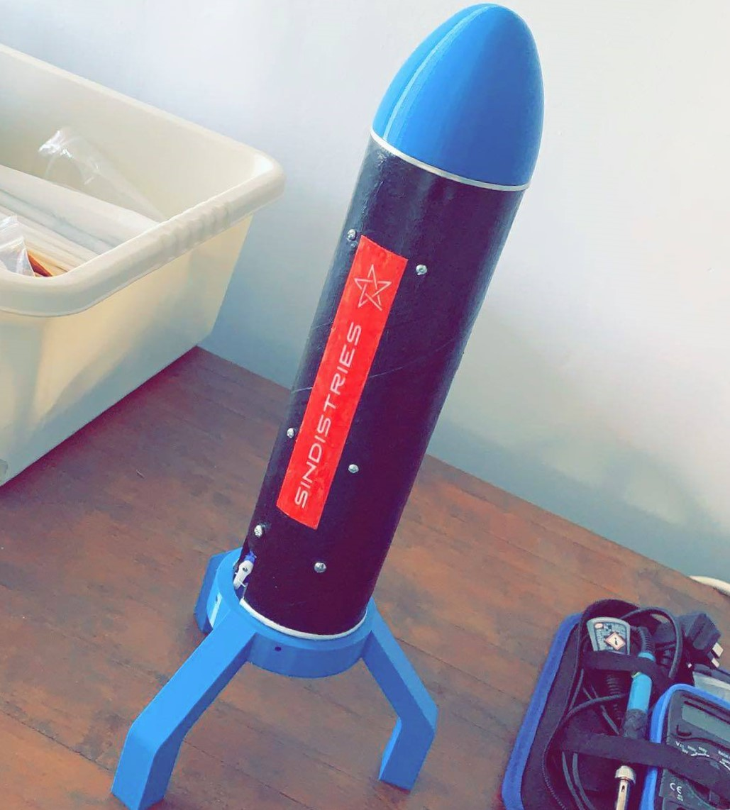

# Thrust Vector Controlled Model Rocket

## Summary:

  

With a strong fascination towards autonomous rocketry, most notably SpaceX and their 
progress with landing rockets I was keen to work on something of my own over the summer after the
end of first year and learn more about what goes into developing such a system. I hence set out to 
build a rocket capable of thrust vectoring for stability since active stability and control 
systems play a critical role in more complex autonomous systems. I went on to design a model of rocket and 2-axis gimbal system 
on SolidWorks, design and put together a flight computer, design control system, develop a simulation and assemble the physical rocket.

## Documentation:

[__CAD Model__](docs/cad_model.md)

[__Flight computer__](docs/flight_computer.md)

[__Control System__](docs/control_system.md)

[__3D Python Simulation__](docs/3Dsim.md)

