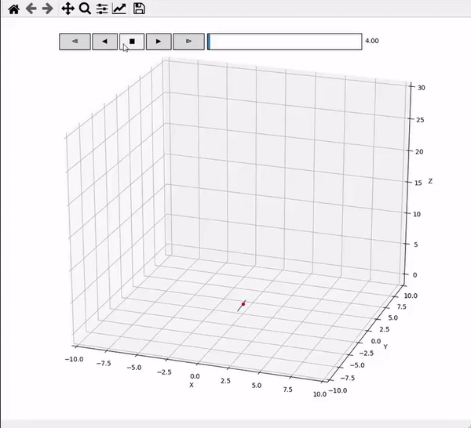
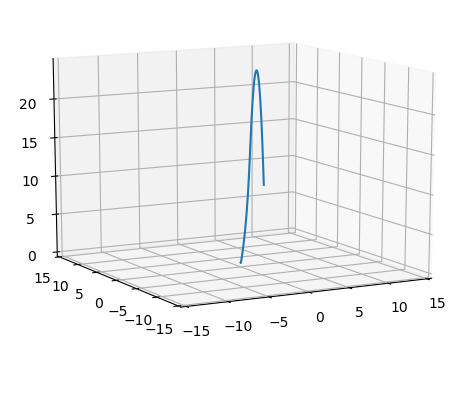

# 3D Python Simulation

The control system is designed in such a way that it operates on each axis seperately which should be a valid for small perturbations and so I believed 
it would be worthwhile to have a 3D simulation of the rocket to simualte the uncoupled controlled on the 3D system. With this I also developed an interactive animation
of the flight to be able to carefully examine the trajectory.

    

[__CAD Model__](cad_model.md)

[__Flight computer__](flight_computer.md)

[__Control System__](control_system.md)
