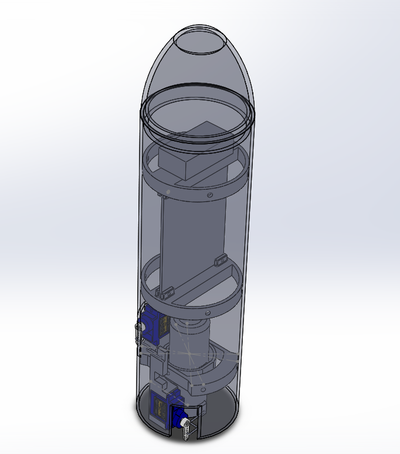
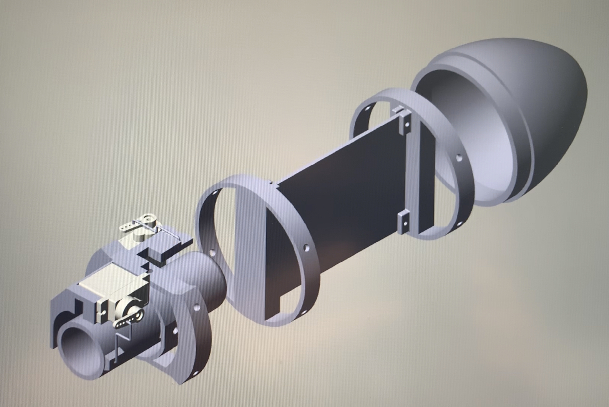
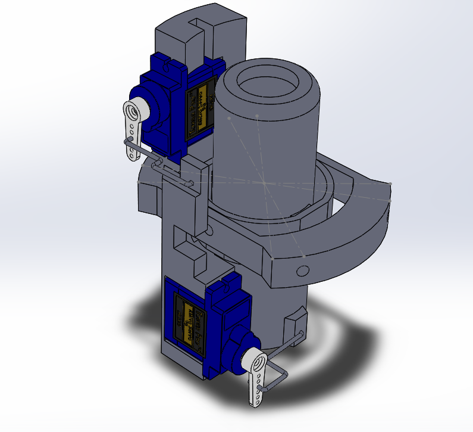
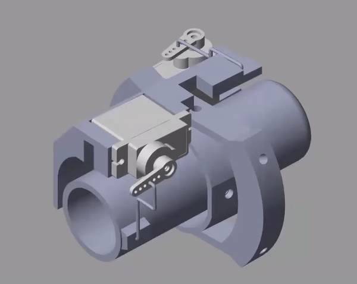

# CAD model

I used SolidWorks to develop a full model of the Rocket in order to design the parts to 3D print for the physical rocket and to 
obtain estimate the mass properties of the rocket for simulation and control system design purposes.

    

  

