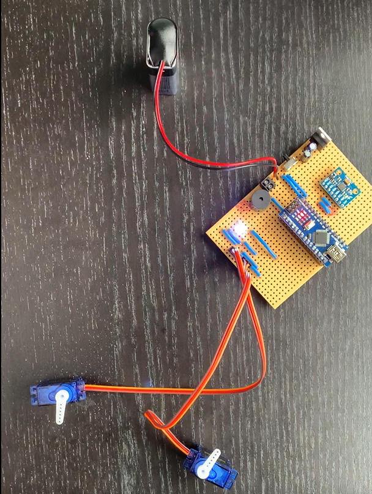
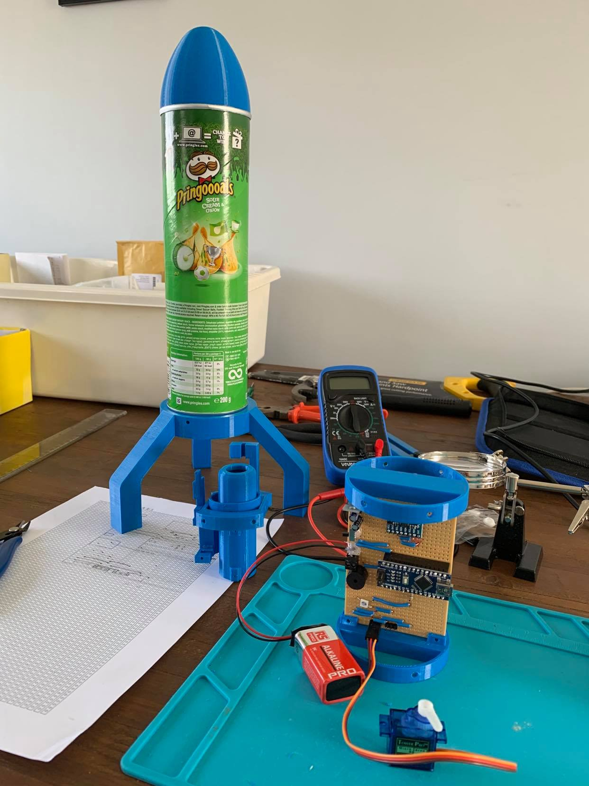

# Flight Computer

The flight computer consists of a Arduino nano, MPU6050 accelerometer, buzzer, LED assmbled onto veroboard. The primary purpose of the flight computer is to take
the orientation data of the rocket to correct for tilt by acctuation of the servos which gimbal the rocket motor, a demonstation of this can be seen in the image below where
the board has been programmed to tilt the thrust in a way which mimics the motion of the board.

     

 
